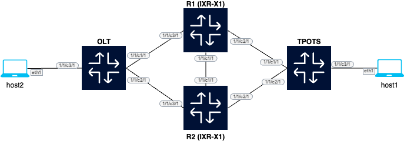

# EVPN Multi-homing (EVPN-MH) testing

This lab includes two 7250 IXR-X1 to provide connectivity between host1 and host2 connected via OLT and TPOTS which are multi-homed to the two IXR.

This lab uses EVPN-MH All-Active.

### Topology

